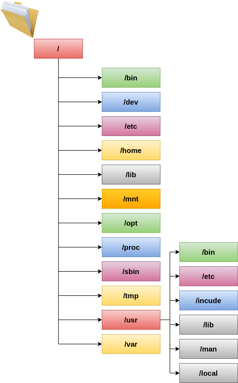
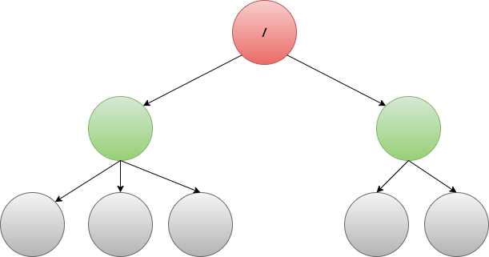
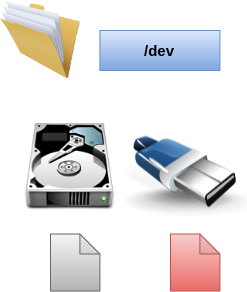
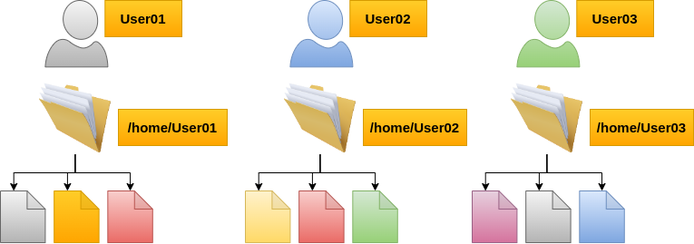
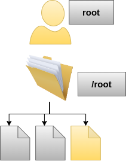

# 1. Estructura de directorios del sistema operativo Linux.
En este documento se describe lo que contiene cada uno de los directorios principales de Linux. La siguiente imagen
muestra la estructura de los directorios.

## 1.1. Directorio raíz (/).
Todo en el sistema operativo Linux esta localizo dentro del directorio raíz, se puede realizar la analogía
con un árbol, el directorio raíz representa la raíz de un árbol.

## 1.2. Directorio bin (/bin).
Cuando el sistema es montado en modo de un solo usuario, este directorio contiene los programas escenciales
para que el sistema pueda funcionar.

## 1.3. Directorio bot (/bot).
En este directorio se almacenan los archivos necesarios para arrancar el sistema operativo.

## 1.4. Directorio dev (/dev).
Los dispositivos son vistos como archivos por el sistema operativo Linux, este directorio contiene los archivos
que representan a dichos dispositivos, también contienen pseudo-dispositivos que no representan a un dispositvo
real.

## 1.5. Directorio etc (/etc).
Este directorio contiene los archivos de configuración del sistema operativo.

## 1.6. Directorio home (/home).
Este directorio contiene los directorios de los usuarios presentes en el sistema operativo.
Cada directorio contiene los archivos que le pertenecen a dicho usuario, así como los archivos 
de configuración correspondientes a cada usuario.

## 1.7. Dirctorio lib (/lib).
El directorio lib contiene librerias compartidas necesarias por los programas almacenados en /bin y /sbin.

## 1.8. Directorio lost+found (/lost+found).
Cuando el sistema llega a fallar, los archivos que quedaron corrompidos se colocan en este directorio, para poder
recuperar la mayor cantidad de información posible.

## 1.9. Directorio media (/media).
Cuando se ingresa un dispositivo remobible como un CD se crea un directorio dentro del directorio /media para
poder acceder al contenido del CD.

## 1.10. Directorio mnt (/mnt).
En el directorio mnt se suele utilizar para montar sistemas de archivos temporales, un ejemplo podria ser montar
una partición de Windows para realizar operaciones de recuperación de archivos, no es obligatorio montar la partición
en este directorio.

## 1.11. Directorio opt (/opt).
Contiene subdirectorios de paquetes de software opcionales.

## 1.12. Directorio proc (/proc).
Contiene archivos especiales que representan procesos e información del sistema.

## 1.13. Directorio root (/root).
Este directorio tiene la funcionalidad del directorio /home con la diferencia de que este solo almacena archivos
del usuario root. 

 
## 1.14. Directorio run (/run).
En este directorio las aplicaciones almacenan archivos que usan con frecuencia como sockets o ID's de procesos.

## 1.15. Directorio sbin (/sbin).
Contiene archivos binarios que solamanete pueden ser ejecutados por el usuario root del sistema operativo.

## 1.16. Directorio selinux (/selinux).
Este directorio solo aparece en distribuciones como Fedora o Red Hat que utilizan SELinux para seguridad.

## 1.17. Directorio srv (/srv).
En el directorio srv se guardan datos para los servicios que provee el sistema.

## 1.18. Directorio tmp (/tmp).
Este directorio almacena archivos temporales utilizados por las aplicaciones, dichos archivos generalmente son 
elminiados cuando el sistema se reinicia.

## 1.19. Directorio usr (/usr).
Contiene aplicaciones y archivos utilizados por los usuarios que no son vitales para el funcionamiento del sistema
operativo. En este directorio solo se puede leer.

## 1.20. Directorio var (/var).
Contiene archivos en los que normalmente se escriben, por ejemplo archivos log.
